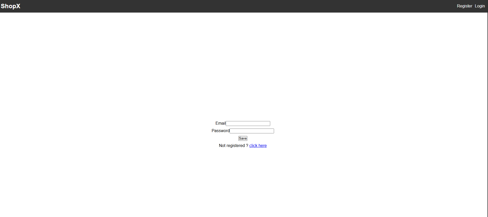
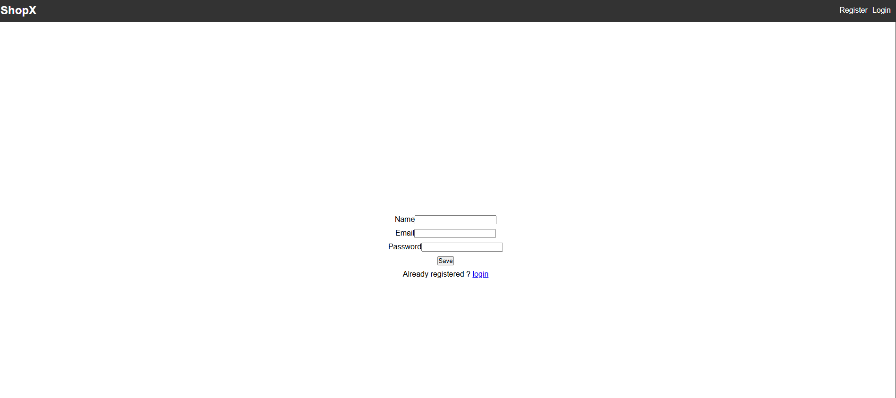
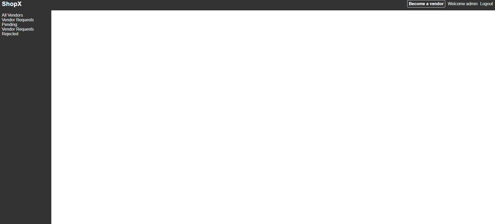
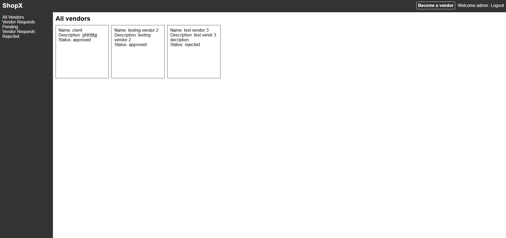
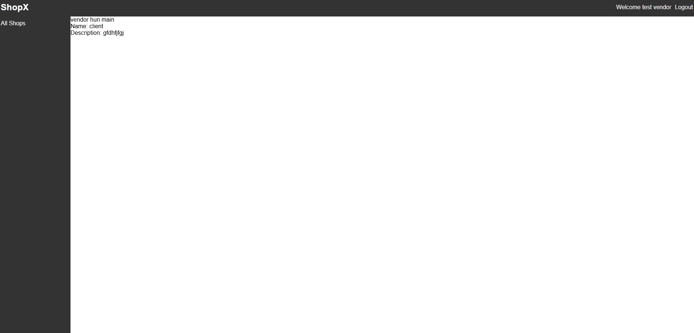

# SHOPX
a multivendor shopping web app

current features:
* backend:
    * auth:
        * user schema with different roles of user
        * register endpoint with encrypting password implemented
        * login endpoint with token generation using jsonwebtoken
        * user role based auth middleware
    * vendor:
        * vendor schema and linked to the user schema
        * new vendor can be created
        * vendor can see their name and description
    * admin:
        * admin can see vendor requests and filter by type using query based search `type=pending/rejected`

* frontend:
    * login and register page with link to backend
    * new vendor can send join request from navbar using `Become a vendor button`
    * logged in user can either be vendor, user or admin, dashboard and sidebar only visible to vendor or admin, but user can see profile page
    * a custom dialog to approve/reject vendor requests

week three complete -- vendor system complete

Screenshots:
 Login: 
 Register: 
 Admin View: 
 Admin/all vendors: 
 Vendor View: 